# Visited: https://blog.logomaster.ai/mercedes-benz-logo-evolution
**Time:** Wed May 13 13:19:26 UTC 2026

## Screenshot
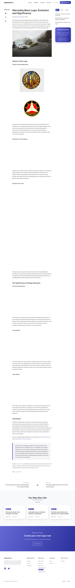

## Raw HTML
[page.html](./page.html)

## Downloaded Media (16 files)
## Downloaded Media Files

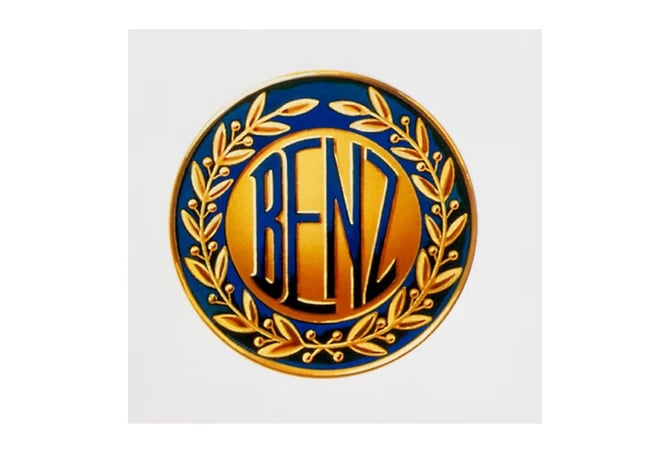
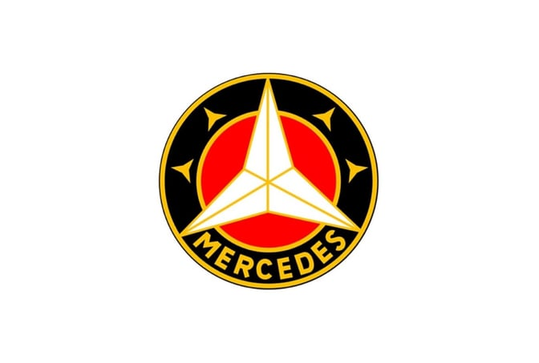
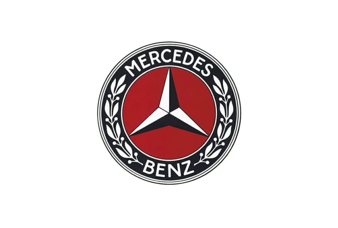
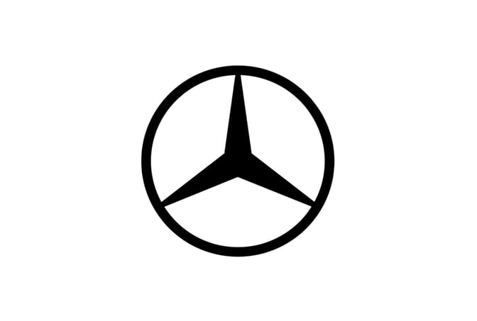
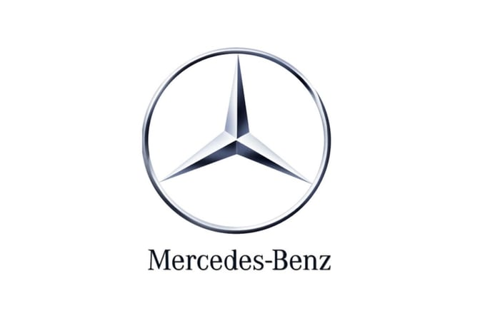
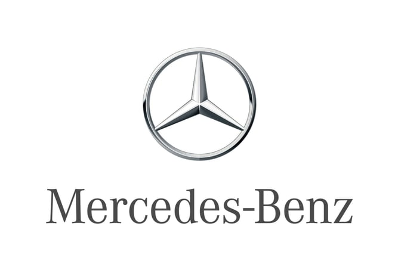
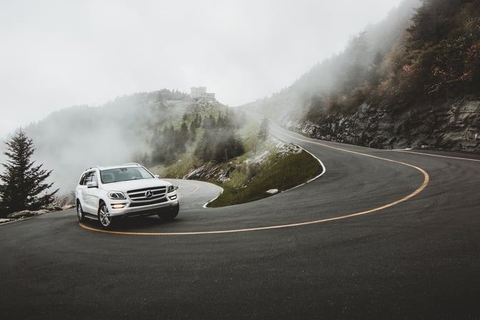

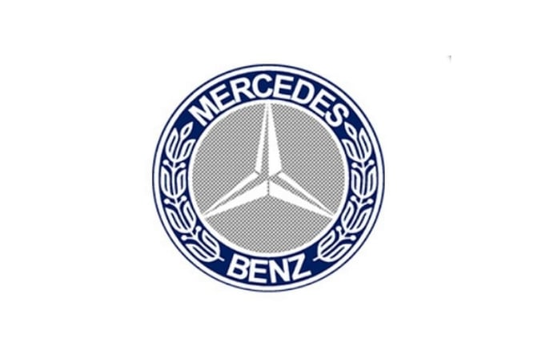

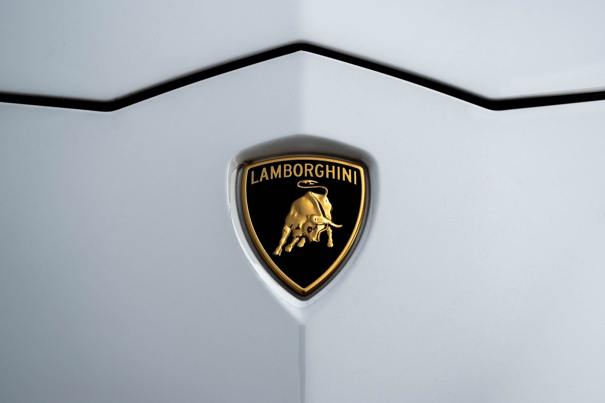
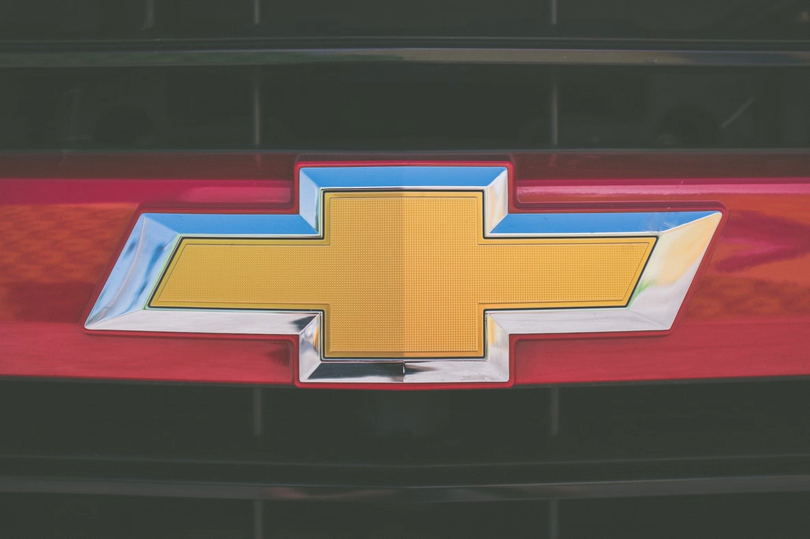
- [favicon.ico](./media/favicon.ico) (7 KB)
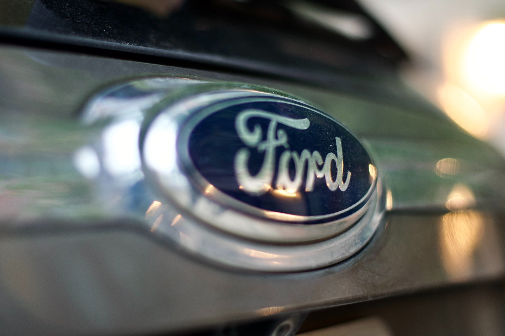

## Other Links
- [#](#)
- [/?hsLang=en](/?hsLang=en)
- [/apple-logo-evolution?hsLang=en](/apple-logo-evolution?hsLang=en)
- [/chevrolet-logo-evolution?hsLang=en](/chevrolet-logo-evolution?hsLang=en)
- [/hs/hsstatic/AsyncSupport/static-1.501/js/post_listing_asset.js](/hs/hsstatic/AsyncSupport/static-1.501/js/post_listing_asset.js)
- [/hs/hsstatic/AsyncSupport/static-1.501/sass/rss_post_listing.css](/hs/hsstatic/AsyncSupport/static-1.501/sass/rss_post_listing.css)
- [/hs/hsstatic/HubspotToolsMenu/static-1.640/js/index.js](/hs/hsstatic/HubspotToolsMenu/static-1.640/js/index.js)
- [/hs/hsstatic/content-cwv-embed/static-1.1293/embed.js](/hs/hsstatic/content-cwv-embed/static-1.1293/embed.js)
- [/hs/hsstatic/cos-i18n/static-1.53/bundles/project.js](/hs/hsstatic/cos-i18n/static-1.53/bundles/project.js)
- [/hs/scriptloader/22400058.js](/hs/scriptloader/22400058.js)
- [https://app.logomaster.ai/create](https://app.logomaster.ai/create)
- [https://app.logomaster.ai/my-logos](https://app.logomaster.ai/my-logos)
- [https://app.logomaster.ai/pricing](https://app.logomaster.ai/pricing)
- [https://app.logomaster.ai/templates](https://app.logomaster.ai/templates)
- [https://blog.logomaster.ai](https://blog.logomaster.ai)
- [https://blog.logomaster.ai/](https://blog.logomaster.ai/)
- [https://blog.logomaster.ai/archive/2023/03](https://blog.logomaster.ai/archive/2023/03)
- [https://blog.logomaster.ai/archive/2023/04](https://blog.logomaster.ai/archive/2023/04)
- [https://blog.logomaster.ai/archive/2023/06](https://blog.logomaster.ai/archive/2023/06)
- [https://blog.logomaster.ai/archive/2023/08](https://blog.logomaster.ai/archive/2023/08)
- [https://blog.logomaster.ai/archive/2023/10](https://blog.logomaster.ai/archive/2023/10)
- [https://blog.logomaster.ai/author/logomaster-team](https://blog.logomaster.ai/author/logomaster-team)
- [https://blog.logomaster.ai/chevrolet-logo-evolution?hsLang=en](https://blog.logomaster.ai/chevrolet-logo-evolution?hsLang=en)
- [https://blog.logomaster.ai/de/mercedes-benz-logo-entwicklung](https://blog.logomaster.ai/de/mercedes-benz-logo-entwicklung)
- [https://blog.logomaster.ai/ford-logo-evolution-significance?hsLang=en](https://blog.logomaster.ai/ford-logo-evolution-significance?hsLang=en)
- [https://blog.logomaster.ai/hubfs/hub_generated/module_assets/1/99124445532/1741200476992/module_icon.min.css](https://blog.logomaster.ai/hubfs/hub_generated/module_assets/1/99124445532/1741200476992/module_icon.min.css)
- [https://blog.logomaster.ai/hubfs/hub_generated/template_assets/1/102548988481/1741232936467/template_blog-4.min.css](https://blog.logomaster.ai/hubfs/hub_generated/template_assets/1/102548988481/1741232936467/template_blog-4.min.css)
- [https://blog.logomaster.ai/hubfs/hub_generated/template_assets/1/99122649657/1741232787425/template_modal.min.css](https://blog.logomaster.ai/hubfs/hub_generated/template_assets/1/99122649657/1741232787425/template_modal.min.css)
- [https://blog.logomaster.ai/hubfs/hub_generated/template_assets/1/99122649663/1741232790552/template_column-navigation.min.css](https://blog.logomaster.ai/hubfs/hub_generated/template_assets/1/99122649663/1741232790552/template_column-navigation.min.css)
- [https://blog.logomaster.ai/hubfs/hub_generated/template_assets/1/99123442434/1741232799613/template_nav.min.js](https://blog.logomaster.ai/hubfs/hub_generated/template_assets/1/99123442434/1741232799613/template_nav.min.js)
- [https://blog.logomaster.ai/hubfs/hub_generated/template_assets/1/99123442441/1741232801676/template_blog-nav.min.css](https://blog.logomaster.ai/hubfs/hub_generated/template_assets/1/99123442441/1741232801676/template_blog-nav.min.css)
- [https://blog.logomaster.ai/hubfs/hub_generated/template_assets/1/99123455496/1741232811215/template_header-01.min.css](https://blog.logomaster.ai/hubfs/hub_generated/template_assets/1/99123455496/1741232811215/template_header-01.min.css)
- [https://blog.logomaster.ai/hubfs/hub_generated/template_assets/1/99123455498/1741232812108/template_mobile-nav.min.css](https://blog.logomaster.ai/hubfs/hub_generated/template_assets/1/99123455498/1741232812108/template_mobile-nav.min.css)
- [https://blog.logomaster.ai/hubfs/hub_generated/template_assets/1/99123534200/1741232817199/template_lang-select.min.css](https://blog.logomaster.ai/hubfs/hub_generated/template_assets/1/99123534200/1741232817199/template_lang-select.min.css)
- [https://blog.logomaster.ai/hubfs/hub_generated/template_assets/1/99123540577/1741232820265/template_modal.min.js](https://blog.logomaster.ai/hubfs/hub_generated/template_assets/1/99123540577/1741232820265/template_modal.min.js)
- [https://blog.logomaster.ai/hubfs/hub_generated/template_assets/1/99123839569/1741232828903/template_lightbox.min.js](https://blog.logomaster.ai/hubfs/hub_generated/template_assets/1/99123839569/1741232828903/template_lightbox.min.js)
- [https://blog.logomaster.ai/hubfs/hub_generated/template_assets/1/99123980624/1741232835031/template_rich-text.min.css](https://blog.logomaster.ai/hubfs/hub_generated/template_assets/1/99123980624/1741232835031/template_rich-text.min.css)
- [https://blog.logomaster.ai/hubfs/hub_generated/template_assets/1/99124153433/1741232841209/template_site-search.min.js](https://blog.logomaster.ai/hubfs/hub_generated/template_assets/1/99124153433/1741232841209/template_site-search.min.js)
- [https://blog.logomaster.ai/hubfs/hub_generated/template_assets/1/99124153467/1741232845393/template_section-extra-settings.min.css](https://blog.logomaster.ai/hubfs/hub_generated/template_assets/1/99124153467/1741232845393/template_section-extra-settings.min.css)
- [https://blog.logomaster.ai/hubfs/hub_generated/template_assets/1/99124200364/1741232853093/template_tabs.min.css](https://blog.logomaster.ai/hubfs/hub_generated/template_assets/1/99124200364/1741232853093/template_tabs.min.css)
- [https://blog.logomaster.ai/hubfs/hub_generated/template_assets/1/99124444968/1741232861713/template_lang-select.min.js](https://blog.logomaster.ai/hubfs/hub_generated/template_assets/1/99124444968/1741232861713/template_lang-select.min.js)
- [https://blog.logomaster.ai/hubfs/hub_generated/template_assets/1/99124445579/1741232872722/template_nav.min.css](https://blog.logomaster.ai/hubfs/hub_generated/template_assets/1/99124445579/1741232872722/template_nav.min.css)
- [https://blog.logomaster.ai/hubfs/hub_generated/template_assets/1/99124446484/1741232878344/template_site-search.min.css](https://blog.logomaster.ai/hubfs/hub_generated/template_assets/1/99124446484/1741232878344/template_site-search.min.css)
- [https://blog.logomaster.ai/hubfs/hub_generated/template_assets/1/99124503903/1741232883775/template_tabs.min.js](https://blog.logomaster.ai/hubfs/hub_generated/template_assets/1/99124503903/1741232883775/template_tabs.min.js)
- [https://blog.logomaster.ai/hubfs/hub_generated/template_assets/1/99124503942/1741232887001/template_main.min.css](https://blog.logomaster.ai/hubfs/hub_generated/template_assets/1/99124503942/1741232887001/template_main.min.css)
- [https://blog.logomaster.ai/hubfs/hub_generated/template_assets/1/99124679231/1741232898101/template_section-intro.min.css](https://blog.logomaster.ai/hubfs/hub_generated/template_assets/1/99124679231/1741232898101/template_section-intro.min.css)
- [https://blog.logomaster.ai/hubfs/hub_generated/template_assets/1/99131226146/1741232905903/template_mobile-nav.min.js](https://blog.logomaster.ai/hubfs/hub_generated/template_assets/1/99131226146/1741232905903/template_mobile-nav.min.js)
- [https://blog.logomaster.ai/hubfs/hub_generated/template_assets/1/99131270014/1741232916702/template_main.min.js](https://blog.logomaster.ai/hubfs/hub_generated/template_assets/1/99131270014/1741232916702/template_main.min.js)
- [https://blog.logomaster.ai/hubfs/hub_generated/template_assets/1/99131302439/1741232926510/template_blog-card.min.css](https://blog.logomaster.ai/hubfs/hub_generated/template_assets/1/99131302439/1741232926510/template_blog-card.min.css)
- [https://blog.logomaster.ai/hubfs/hub_generated/template_assets/1/99131510303/1741232928512/template_footer-11.min.css](https://blog.logomaster.ai/hubfs/hub_generated/template_assets/1/99131510303/1741232928512/template_footer-11.min.css)

## Stats
- Links: 98
- Media: 16
